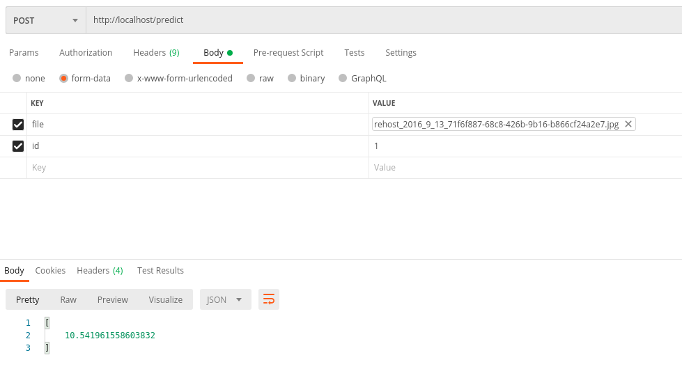

# SpyFace

## Descrição

O Spyface é um projeto desenvolvido para fins acadêmicos. Tem o objetivo de ser uma ferramenta para ajudar em operações de recuperação de fugitivos.

## Como executar localmente

Para utilizar o SpyFace localmente será necessário que você tenha algumas ferramentas instaladas em seu ambiente:

### Pré requisitos

* Python 3.8
* Virtualenv
* Docker
* Docker compose
* Postman (Ou similares, como insomnia. também pode ser utilizado wger ou curl. Por questões de praticidade usaremos o postman neste exemplo)

### Importando imagens e treinando modelos

Para executar a importação de imagens é necessário que o serviço do MongoDB esteja em execução. Para levantar esse serviço execute o comando abaixo:

```shell
$ docker-compose up -d mongodb
```

Assim que o serviço estiver em execução é necessário executar o arquivo Testagem.py, onde as imagens serão importadas, tratadas para o treinamento, o treinamento em si e o teste do modelo. Para executar a testagem é necessário criar o ambiente virtual e instalar as dependências. Para realizar esse procedimento execute os comando abaixo:

```shell
$ virtualenv -p python3 venv
```

```shell
$ . venv/bin/activate
```

```shell
$ pip install -r requirements.txt
```

Com as dependências instaladas e o ambiente configurado execute arquivo Testagem.py com o seguinte comando:

```shel
$ python Testagem.py
```

Ao final do processo será gerado um arquivo nomeado EigenClassifier_ID1.yml. Este arquivo é o artefato que deve ser adicionado na API para ser usado na comparação das imagens enviadas.

Agora é necessário configurar o ambiente da API:

* Copie o arquivo EigenClassifier_ID1.yml para a pasta api
* Renomei o arquivo para EigenClassifier.yml

Tendo adicionado o artefato na pasta da API agora é necessário criar a imagem e executar o serviço para disponibilizar a rota de envio de imagens ao preditor. Para criar e executar o serviço da API digite o comando abaixo:

```shel
$ docker-compose up -d --build api
```

### Enviando imagens via API

Para validar se a API está funcionando corretamente teste acessando a url http://localhost/health pelo seu navegador, ou envie uma requisição com a ferramenta que tiver acesso. O retorno deve ser similar ao json abaixo:

```json
{
    "status": "ok"
}
```

Com o serviço da API em execução abra o postman e crie uma requisição do tipo POST para a url http://localhost/predict. Na aba "Body" selecione "form-data", insira um campo chave nomeado "id" e adicione o valor 1, crie um novo campo e defina a chave como "file" e escolha o arquivo de imagem que será enviado para a API. A configuração deve ficar similar a seguinte:


Ao enviar a requisição será retornado o score relativo a confiança do fugitivo estar presente na imagem, como mostra o exemplo abaixo:

